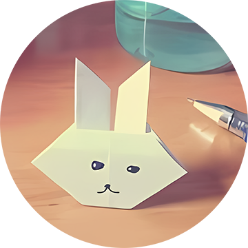
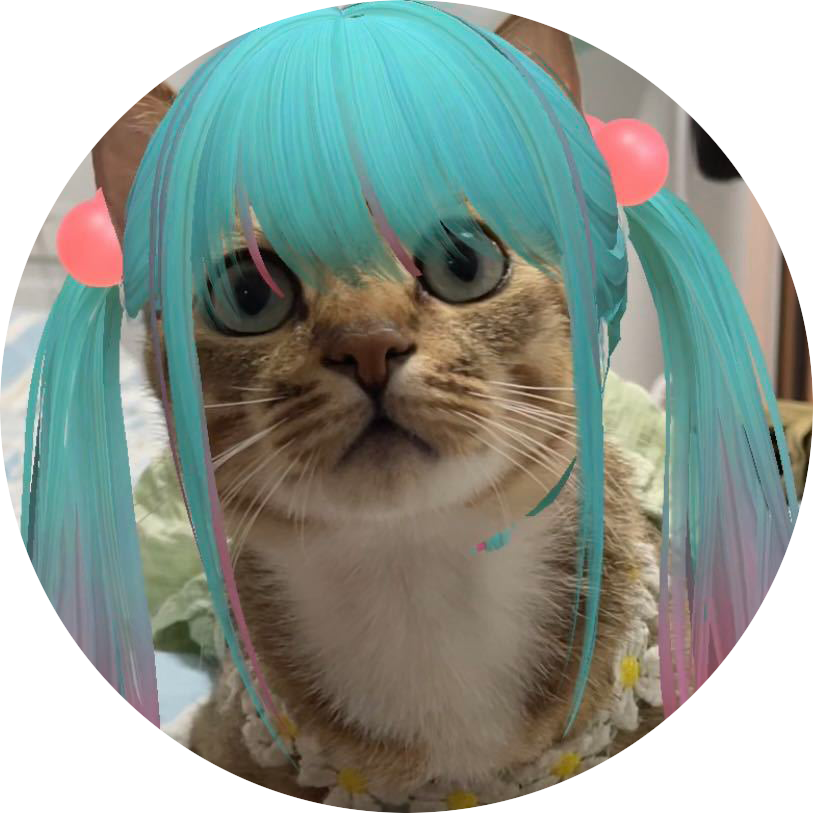
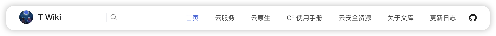
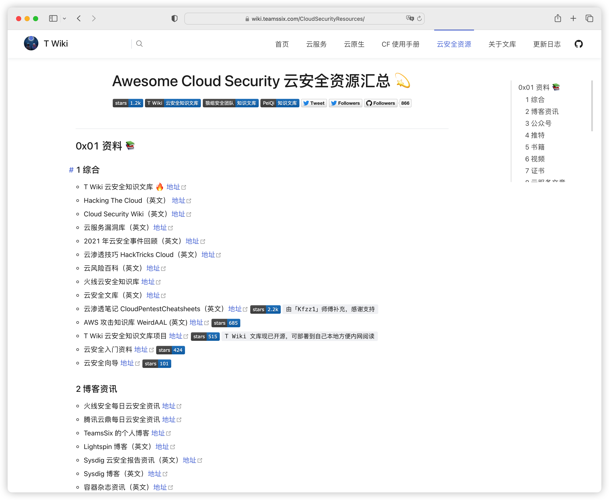
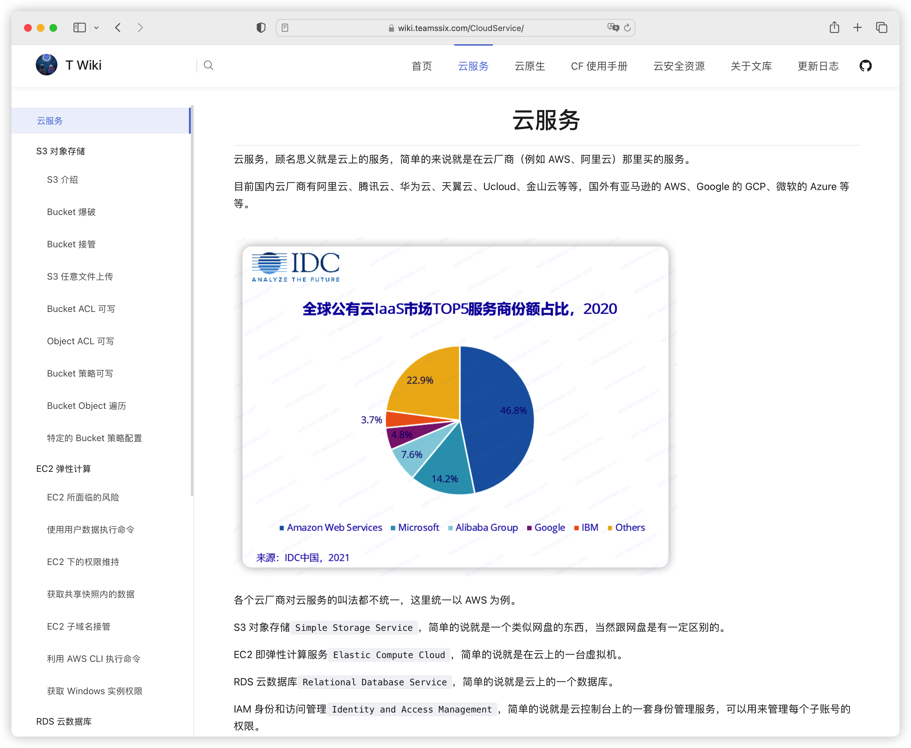
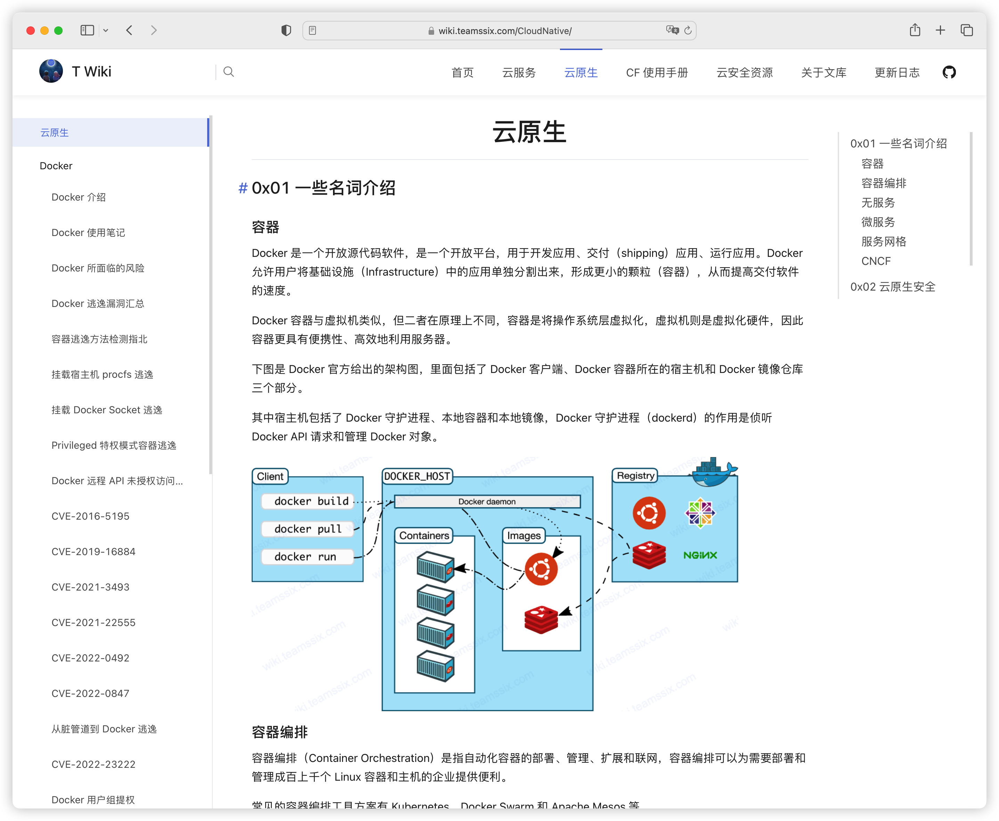
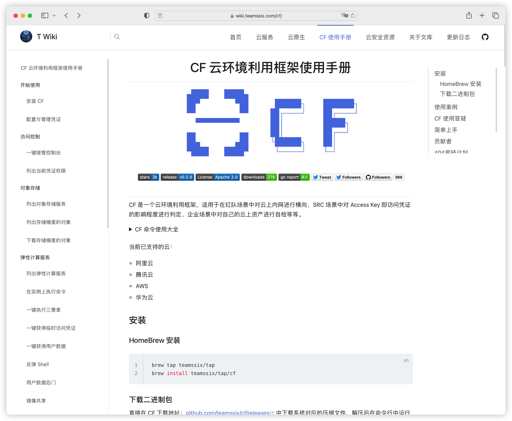

# T Wiki 云安全知识文库

[](https://github.com/teamssix/twiki) [](https://wiki.teamssix.com/) [](https://wiki.wgpsec.org/) [](http://wiki.peiqi.tech/) [](https://twitter.com/teamssix)

## 前言

`T Wiki` 是一个面向云安全方向的知识库，这一点是和其他文库最大的不同，也许这是国内第一个云安全知识文库？

搭建这个文库的起因是笔者发现在云安全方向的中文资料属实不多，少有的这些资料也很散乱，于是搭建了这个文库。

文库的地址为：[wiki.teamssix.com](https://wiki.teamssix.com/)

## 本地部署

### Docker 部署（推荐）

```bash
docker pull teamssix/twiki:main
docker run --name twiki -d -p 7777:80 teamssix/twiki:main
```

然后直接访问本地 IP 的 7777 端口即可。

### 手动部署

> 需要本地先安装 node 且版本需要大于或等于 12

```bash
git clone https://github.com/teamssix/TWiki.git --depth 1
cd TWiki
npm install --global yarn
yarn install
yarn docs:build
```

build 完之后，将 docs/.vuepress/dist 目录下的文件复制到你的 nginx 或者 apache 服务的网站根目录下即可。

## 感谢以下为 T Wiki 文库贡献的师傅们 :confetti_ball:

<table>
    <tr>
        <td align="center"><br />TeamsSix</td>
        <td align="center"><br />1derian</td>
        <td align="center"><br />ShangRui-hash</td>
        <td align="center"><br />半人间丶</td>
        <td align="center"><br />UzJu</a>
        </td>
        <td align="center"><br />Idle Life</td>
    </tr>
    <tr>
        <td align="center"><br />zhengjim</a>
        </td>
        <td align="center"><br />zxynull</a>
        </td>
        <td align="center"><br />m4d3bug</a>
        </td>
        <td align="center"><br />da Vinci【达文西】</a>
        </td>
        <td align="center"><br />tanger</a>
        </td>
        <td align="center"><br />想走安全的小白</a>
        </td>
    </tr>
    <tr>
        <td align="center"><br />Esonhugh</a>
        </td>
        <td align="center"><br />一生热爱</a>
        </td>
        <td align="center"><br />Kfzz1</a>
        </td>
        <td align="center"><br />happi0</a>
        </td>
        <td align="center"><br />cr</a>
        </td>
        <td align="center"><br />k.so</a>
        </td>
    </tr>
    <tr>
        <td align="center"><br />zunlongzhou</a>
        </td>
        <td align="center"><br />Ma1tobiose</a>
        </td>
        <td align="center"><br />DVKunion</a>
        </td>
        <td align="center"><br />曾哥</a>
        </td>
        <td align="center"><br />苏打养乐多</a>
        </td>
        <td align="center"><br />R!ng0</a>
        </td>
    </tr>
    <tr>
        <td align="center"><br />2h0ng</a>
        </td>
        <td align="center"><br />橘子怪</a>
        </td>
        <td align="center"><br />shadowabi</a>
        </td>
        <td align="center"><br />宅独青年</a>
        </td>
        <td align="center"><br />弱鸡</a>
        </td>
        <td align="center"><br />RBPi</a>
        </td>
    </tr>
    <tr>
        <td align="center"><br />程皮糖别皮</a>
        </td>
        <td align="center"><br />Kagantua</a>
        </td>
        <td align="center"><br />feng</a>
        </td>
        <td align="center"><br />Poker</a>
        </td>
        <td align="center"><br />Yaney</a>
        </td>
        <td align="center"><br />CC11001100</a>
        </td>
    </tr>
    <tr>
        <td align="center"><br />毅种循环</a>
        </td>
        <td align="center"><br />glan</a>
        </td>
    </tr>
</table>

[一起补充文库？](https://wiki.teamssix.com/About/Contribute.html)


## 文库介绍

首先来看文库首页，文库主要分成了四个板块，分别为`云服务`、`云原生`、`CF 使用手册`、`云安全资源`。



首先来看 [云安全资源](https://wiki.teamssix.com/CloudSecurityResources/) 板块，这个板块是我个人觉着整个知识库较为与众不同的地方，在这里可以看到汇总的云安全资源，比如云安全相关的文章、公众号、工具、靶场等等。



这部分的内容我也同步到了 Github 上单独作为一个项目，项目名称叫做 awesome-cloud-security，项目地址为：[github.com/teamssix/awesome-cloud-security](https://github.com/teamssix/awesome-cloud-security)

如果你知道一些比较好的云安全资源，欢迎留言补充，我会更新到这个板块中，首页的贡献者处也将出现你的身影。

在 [云服务](https://wiki.teamssix.com/CloudService/) 板块可以看到云服务方向的文章、笔记。



在 [云原生](https://wiki.teamssix.com/CloudNative/) 板块可以看到云原生方向的文章、笔记。



在 [CF 使用手册](https://wiki.teamssix.com/cf/) 板块里详细记录了云环境利用框架 CF 工具的使用方法，CF 云环境利用框架工具项目地址：[github.com/teamssix/cf](https://github.com/teamssix/cf)



如果你想要投稿的话，那么在文库的 [一起补充](https://wiki.teamssix.com/About/Contribute.html) 处可以找到投稿的方式。

## 最后

相信通过这些资料能够在一定程度上帮助想要学习或者正在学习云安全的人，同时也欢迎读者一起来完善这个文库，从而帮助到更多的人，一起助力国内云安全的发展。

>  更多信息欢迎关注我的个人微信公众号：TeamsSix

<div align=center></div>
